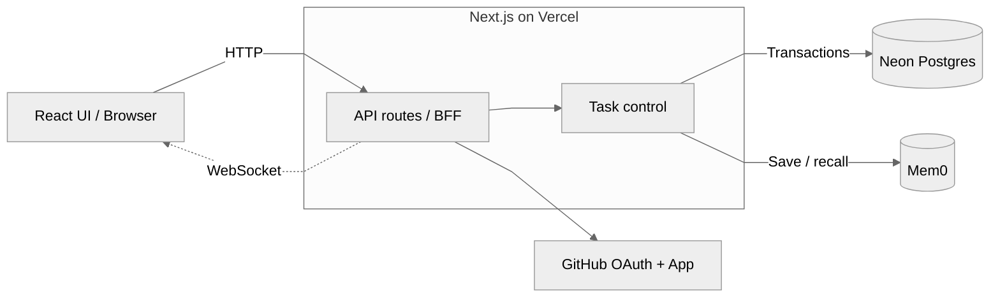
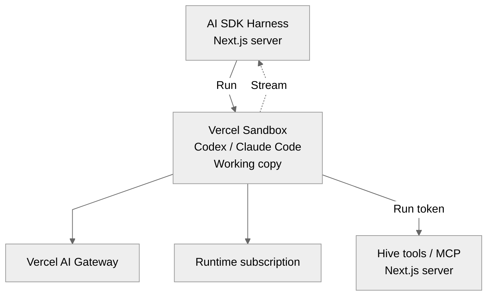

# Hive

**A multiplayer agent running in the cloud.**

Run agent work in a cloud workspace. Bring teammates into the task to share context, guide the agent, and review its changes.

[Try the demo](https://hive-roan-mu.vercel.app/demo) · [Live application](https://hive-roan-mu.vercel.app/) · [Setup](docs/SETUP.md) · [Architecture](#architecture) · [Development](docs/DEVELOPMENT.md)

## Why Hive

**Agent work ties up a local machine.** Hive runs the agent and repository tools in Vercel Sandbox, with a shared workspace the team can access from the browser.

**Team intent is distributed.** An agent might optimize a feature the team has already retired. The code can be correct while the direction is wrong. Teammates can bring that missing decision into the task and steer the work together.

Selected decisions can also become **shared agent memory**, available to future tasks in the same repository. Multiplayer brings context into the current work; memory makes those decisions available beyond one conversation. Saving is explicit and preserves the contribution's author and source.

## How it works

**Start a task → bring in teammates → discuss and steer → review the result.**

The task holds the conversation and cloud working copy together. Ordinary Thread replies give people room to discuss; **Steer thread** turns that discussion into direction. Hive can ask the team for a decision when it needs one.

One run changes the workspace at a time. Submitted input queues during execution and automatically continues after a successful run when a connected client observes completion. Execution and results stay in the main conversation; a structured question answer follows its question's context.

The team reviews actual changes in Files, Diff and Runs. Verification belongs to a particular revision. A later change needs another check; finishing an agent turn leaves the conversation open.

## Try it

The [public demo](https://hive-roan-mu.vercel.app/demo) offers four sample tasks without sign-in. Its output is simulated; it makes no model calls or repository changes.

For real work, [sign in with GitHub](https://hive-roan-mu.vercel.app/), start a task and attach an authorized repository. Invite a teammate to contribute and review while the work is happening. Try a small change: “Make it clearer which page is active in the settings menu.” Have a teammate add “Can we keep keyboard focus distinct from the active page too?” in a Thread, then steer it and review the result together.

## Scope

A task has one conversation, at most one repository and one mutating run at a time. Files supports inspection and annotation. Hive produces reviewable changes; PR creation, merge and deployment are outside the current scope.

Invitations share the task and its working copy. They do not grant access to the inviter's other tasks or repository pool.

Cloud execution is implemented. Durable unattended execution remains a separate [engineering boundary](docs/DEVELOPMENT.md#input-and-execution): execution is request-bound, and checkpoints do not guarantee automatic recovery after worker termination. Provider limits still apply.

## Decisions that shaped the product

- **Share the task.** Keep context, working copy and review together so a teammate can join work in progress.
- **Make direction explicit.** Discussion does not become an instruction until someone steers it; queued input retains its authorship and order.
- **Remember deliberately.** Save selected team decisions with provenance rather than turning every comment into a lasting rule.
- **Keep judgment with the team.** The agent can ask for input; people verify the resulting revision.
- **Reuse the coding runtime.** AI SDK Harness manages agent execution and native history. Hive owns the shared task: authorship, instruction order and review. See [state ownership](docs/DEVELOPMENT.md#state-ownership) for the boundary and reducer trade-off.

## Architecture

### Frontend, BFF and task services



BFF and task services are modules in the same Next.js application. Browser actions use HTTP; live replies, task updates and presence use WebSocket. Postgres grants one mutating run at a time; Mem0 stores explicitly selected decisions for the same repository.

### Agent execution and tools



Model access uses AI Gateway **or** a configured runtime subscription. Hive tools access the task and memory services above; database and Mem0 credentials stay on the Next.js server. Execution is [request-bound](docs/DEVELOPMENT.md#input-and-execution).

Code entry points: [browser sync](src/hooks/use-shared-session.ts), [task API](src/app/api/sessions/[sessionId]/route.ts), [task store](src/server/sessions/task-session-store.ts), [runner](src/server/agents/hive-runner.ts) and [MCP endpoint](src/app/api/sessions/[sessionId]/agent-tools/route.ts). See [setup](docs/SETUP.md) and [runtime details](docs/DEVELOPMENT.md#runtime-changes).

## My role and AI collaboration

I designed the module boundaries and overall framework, and owned the product and architecture decisions. AI worked with me on brainstorming, implementation, debugging and tests.

I evaluated how those implementations served the product. For example, I moved steered work back into the main conversation so the team could follow its progress. Real runs also exposed gaps that fixtures missed, including native question handling. The [development guide](docs/DEVELOPMENT.md) describes the current boundaries; investigations and release evidence remain in Git history and PRs.

## Run locally

Use Node.js 24, the pinned pnpm version, an authenticated Vercel CLI, development Postgres and a GitHub App. Configure `.env.local` from `.env.example` using [the setup guide](docs/SETUP.md).

```sh
pnpm install --frozen-lockfile
pnpm db:migrate
vercel dev
```

## Contributing and verification

```sh
pnpm check
pnpm build --webpack
```

[Code quality](docs/CODE_QUALITY.md) covers ESLint, Prettier, editor settings and commit hooks. [Testing](docs/TESTING.md) documents disposable Postgres, the full release gate and native runtime fixtures. [GitHub Actions](.github/workflows/ci.yml) checks each PR; [production acceptance](docs/RELEASE_ACCEPTANCE.md) separately requires real accounts and model interactions.
