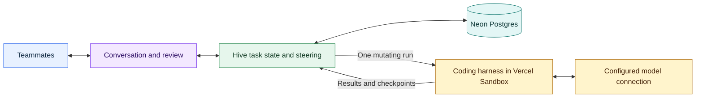

# Hive

**Agentic peer programming for small teams.**

Hive gives teammates one shared coding agent and workspace. One person starts a task; others can join while the work is in progress, ask questions, contribute context, and review changes. The agent can ask the team for input and continue the same task with their answer.

[Try the demo](https://hive-roan-mu.vercel.app/demo) · [Live application](https://hive-roan-mu.vercel.app/) · [Product walkthrough](docs/DEMO_BRIEF.md) · [Design and development](docs/DEVELOPMENT.md) · [Release status](docs/ROADMAP.md)

## Why Hive

When one person works with a coding agent, they hold the prompt, conversation and working copy. A teammate who spots a missing requirement often has to relay it through that person or wait for a pull request. The code can pass its tests and still miss what the team intended.

Hive brings teammates into the task while the code is being made. For example, one person asks for a navigation change. A teammate joins, inspects the work, and points out an ambiguous active state. They clarify the behavior with Hive in a Thread, direct the next change, and check the result together. Each contribution keeps its author. Review is part of the ongoing conversation, and teammates can participate before the agent finishes.

## Try it

Start with the [interactive demo](https://hive-roan-mu.vercel.app/demo): choose any of the four sample tasks to explore questions, team discussion, and review without signing in. The demo uses local sample state and simulated agent output; it does not call a model or change a repository.

For a real task, sign in with GitHub at [hive-roan-mu.vercel.app](https://hive-roan-mu.vercel.app/). You can start alone and invite a teammate later. Joining someone else's task requires its invitation link.

1. **Create a task.** Describe the outcome. Attach a repository available through your GitHub connection when you are ready to work on code.
2. **Discuss the work.** Normal messages address Hive. A leading `@teammate` mention or an ordinary Thread reply stays human discussion.
3. **Choose what Hive acts on.** Use **Steer Hive** for one reply or **Steer thread** for the discussion so far. If a run is active, input queues; apply it after the run ends.
4. **Review the result.** Browse **Files**, inspect **Diff**, and expand commands in **Runs**. Approve the changes when satisfied, or continue the conversation with another steer.

When Hive asks a structured question, **Answer & continue** submits your answer as an instruction. The first eligible answer is recorded once; an idle task continues immediately. During a run, it queues until a safe boundary is observed by a connected client. If everyone closes the task, continuation waits for reconnect. Ordinary discussion still requires explicit steering.

Hive can also request review. Steered feedback returns its response to the original review Thread. **Verify & resolve** records a human check of the current revision; a new run or restore prevents stale verification.

A queued Thread freezes the replies included at that moment. Later replies do not silently change its instructions. Approving a diff leaves the conversation open.

The new question/answer and revision-bound review paths have passed controlled UI and real local Postgres checks. Final production acceptance with two accounts and real model calls remains open in the [release checklist](docs/ROADMAP.md#verification-status).

## What Hive is — and is not

Hive is a shared place to direct and review coding work. A task has one conversation, at most one attached repository, and one workspace-mutating run at a time. Discussion, explicit direction, execution and review recur throughout the task; they are not gates that prevent teammates from joining work in progress.

It is not a general team chat, a project tracker, or a full collaborative IDE. Files supports inspection and annotation rather than simultaneous human editing. The product stops at reviewable changes: it does not create PRs, push Sandbox branches, merge, or deploy generated code.

“Multiplayer” describes people and the shared agent working on the same task, including joining an existing session to contribute or review. Optional research/review subagents are a separate capability whose live acceptance is still pending. Repository memory has passed a bounded live save/recall and source-citation check; live cross-repository isolation remains unverified. See [optional capabilities](docs/ROADMAP.md#optional-capabilities), for dated evidence and remaining acceptance checks.

## Architecture

I designed the product around three responsibilities: shared conversation, ordered agent execution, and inspectable results. Hive owns task membership, attributed input, queue order and review state. An existing coding harness supplies the coding tools and native agent history.



| Component | Role |
| --- | --- |
| Next.js on Vercel | Product UI, authenticated routes and shared task actions. |
| GitHub OAuth + GitHub App | Establish identity, discover the current user's authorized repositories, and issue repository-scoped clone credentials. |
| Neon Postgres | Persist team history, membership, queue, approvals and private recovery records. Row-locked transitions grant execution. |
| AI SDK Harness + Vercel Sandbox | Run Codex or Claude Code in an isolated working copy. Native history remains bound to the selected runtime. |
| Vercel AI Gateway | Provide the Gateway model-access path using Vercel OIDC; configured subscription paths are runtime-specific. |
| WebSockets, Streamdown and Monaco | Share live state, render incremental replies, and present source files for review. |

Task invitations share the conversation and attached working copy, not the inviter's other tasks or repository pool. Browser responses exclude private native recovery data. See [access and setup](docs/SETUP.md) and [runtime compatibility](docs/VERCEL_HARNESS_DECISION.md) for the implementation boundaries.

## Decisions that shaped the product

- **Keep discussion separate from execution.** Teammates need room to disagree and clarify. Explicit steering makes the instruction boundary visible and preserves who contributed it.
- **Serialize changes to the shared workspace.** A database transaction grants one mutating run. Concurrent directions stay in an ordered queue for teammates to apply.
- **Reuse the coding runtime.** I focused the module design on collaboration, control and review, using an existing harness for repository tools and native history.
- **Pair files with agent context.** A checkpoint restores both, preserves team discussion and pending input, and invalidates prior approval. A session ID alone is insufficient recovery state.
- **Let the conversation continue.** I removed the manual Complete/Reopen flow because finishing an agent turn should not close the team's discussion. Diff approval remains a separate decision.
- **Make results inspectable.** Runs shows exit codes and original command output. A successful shell exit is not automatically labeled a passing test result.

The [decision log](docs/DEVELOPMENT.md#design-decisions) records alternatives and subsequent corrections. Workflow integration is deferred; the current executor is request-bound. Browser reconnection and manual lost-run recovery do not guarantee automatic execution resumption after worker termination. Provider 429s remain possible, and retries are bounded.

## My role and AI collaboration

I designed Hive's module boundaries and overall framework. I worked with AI to brainstorm alternatives and implement the design, and owned the product and architecture decisions as the experience evolved. Those decisions included one task per session, late repository attachment, explicit steering, and keeping review separate from conversation closure.

AI contributed implementation, debugging and regression tests. Verification sometimes overturned its output: an edit command masked failure behind exit zero, and an AI-written regression queried a button that was intentionally hidden. The assisting agent reproduced and repaired those defects. The [development history](docs/DEVELOPMENT.md#evidence-log) records the interventions and resulting checks.

## Run locally

Use Node.js 24, pnpm 11.19.0, an authenticated Vercel CLI, development Postgres and a GitHub App. Configure `.env.local` from [`.env.example`](.env.example), then run:

```bash
pnpm install
pnpm db:migrate
vercel dev
```

[Setup and integrations](docs/SETUP.md) covers GitHub callbacks, database connections and optional memory configuration.

## Verification

```bash
pnpm test
pnpm lint
pnpm typecheck
pnpm build --webpack
```

[GitHub Actions](.github/workflows/ci.yml) also runs integration checks against disposable Postgres. Coverage includes attribution, access control, queue boundaries, reconnect ordering, checkpoint restore, live transport and memory integration. External model and memory services are controlled in local tests.

Recorded production checks include a real two-file coding change with passing commands, two-account discussion and steering, native streaming, paired restores, and a bounded memory save/recall. The coding result passed 125 unit tests on its saved Sandbox revision, not the current app revision. The assisting agent operated both accounts and supplied repair guidance; this was not independent human review or autonomous first-pass completion.

See [testing instructions and evidence](docs/TESTING.md) and [remaining release checks](docs/ROADMAP.md#verification-status) for dates, versions and limitations.
